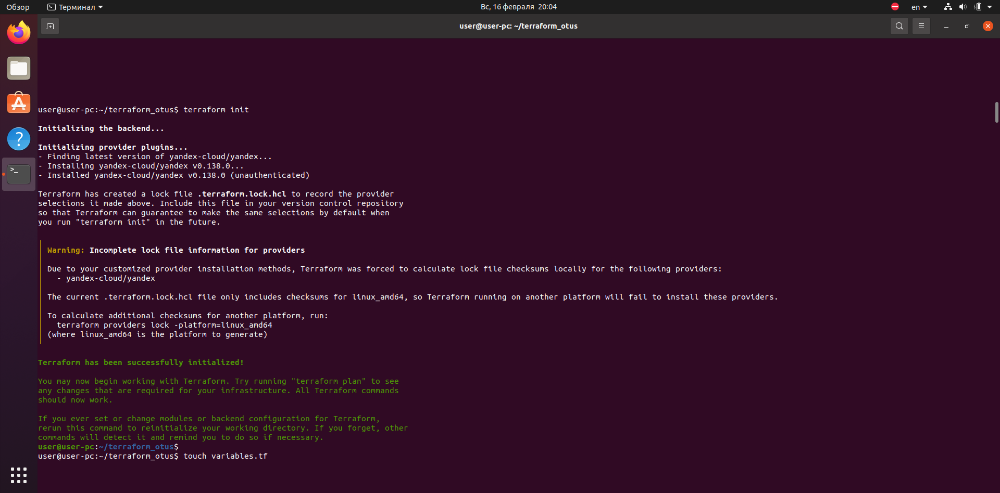
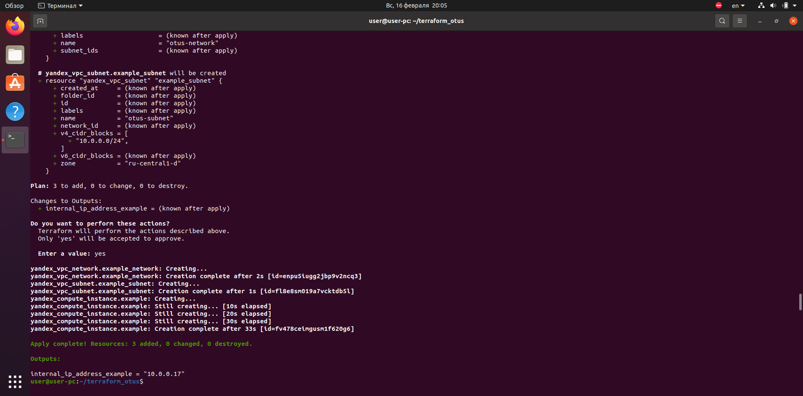
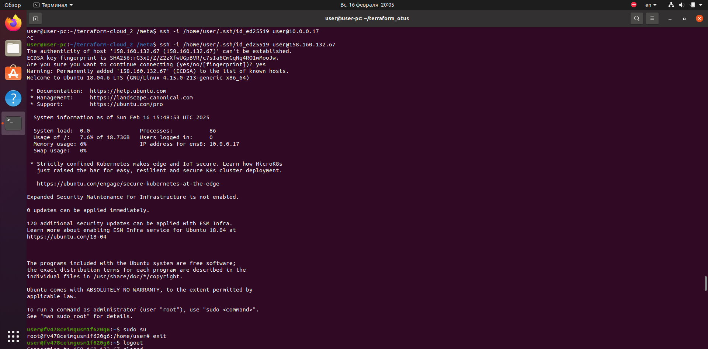

# terraform_otus

Шаги выполнения задания
1. Установил terraform по инструкции от яндекса
2. Добавил переменные окружения для возможности работы с облаком при помощи следующих команд:
export YC_TOKEN=$(yc iam create-token)
export YC_CLOUD_ID=$(yc config get cloud-id)
export YC_FOLDER_ID=$(yc config get folder-id)

Где:

YC_TOKEN — IAM-токен.
YC_CLOUD_ID — идентификатор облака.
YC_FOLDER_ID — идентификатор каталога.

3. В файл main.tf добавил блоки с описанием провайдера и зоной доступности по умолчанию
4. Создал файл .gitignore и указал в нём не выкладывать в github файл tfstate, чтобы чувствительные данные не оказались в публичном репозитории
5.Выполнил команду terraform init

5. В файле main.tf описал следующие ресурсы для создания виртуальной машины:
- Сеть
- Подсеть для которой использовал переменную var.zone значение которой хранится в variables.tf
- Инстанс виртуальной машины с описанием необходимого количества CPU и RAM, также добавил блок с описанием дискового пространства при помощи переменной var.vm_disk_size
- Сетевой интерфейс

5. Добавил блок metadata c описанием параметров для настройки пользователя и указанием ключа для авторизации в создаваемой вм со следующим содержимым metadata:
users:
  - name: user
    groups: sudo
    shell: /bin/bash
    sudo: ["ALL=(ALL) NOPASSWD:ALL"]
    ssh-authorized-keys:
      -  ssh-ed25519 <public_key> user@user-pc
6. Добавил запись data "yandex_compute_image" "image" и использовал переменную var.vm_image_family с указанием какую именно ОС нужно использовать при создании ВМ

7. Добавил вывод ip адреса при выполнении terraform apply

8. Выполнил последовательно комманды terraform plan и terraform apply и получил адрес созднной виртуальной машины.

9. Проверил в облаке наличие созданных ресурсов и подключился к вм по её внешнему ip адресу(скриншот из облака приложу к дз)

